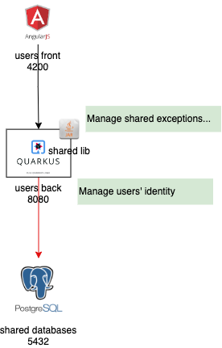
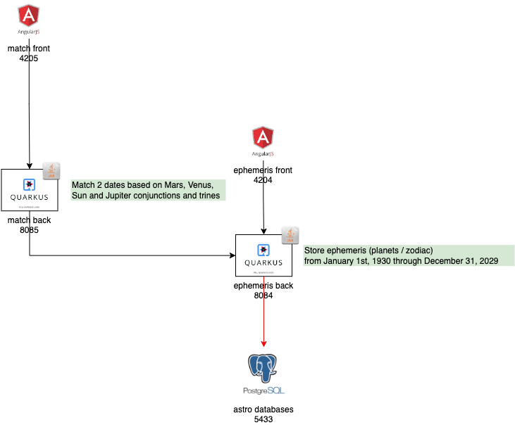
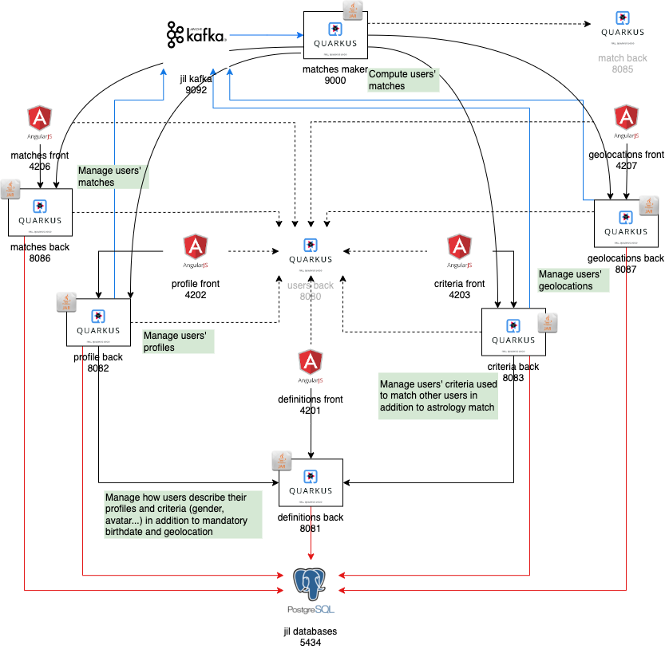

# Architecture

The project is comprised of 3 sub projects:
- shared, used by the 2 others, at build and run times. It provides a shared library and a basic identity manager.
- astro (i.e. astrology), used by jil, at run time. It provides planet positions (i.e. ephemeris) for a century and an astrological matching algorithm between 2 days.
- jil (i.e. Just in Love). For users who provide their profile, criteria and geolocation, it provides the users that match the astrological algorithm and criteria.

Backends are developed in Quarkus and run in Jboss.  
Frontents are developed in Carbon Design Angular and run in NodeJS.  
Databases run in PostgreSQL.  

## Architecture of shared

Shared consists of:  
- a shared java library embedded in all backends. It manages common exceptions and types.  
- a user identity backend used (http) by most jil backends. It manages logins.  
- a user identity frontend. It manage users.  
- a database. It stores users.

## Architecture of astro

Shared consists of:  
- an ephemeris backend. It lists ephemeris.  
- an ephemeris fontend.  It displays the ephemeris of a given day.  
- a database. It stores a century ~ 100 * 365 ephemeris.
- a match backend. It implements the astrological matching algorithm between 2 days.  
- a match fontend. It displays the astrological matching between 2 given days.  

## Architecture of jil

Shared consists of:  
- a definition backend and frontend. It manages definitions, i.e. attributes (gender, avatar...) users use in profile and criteria.
- a definition database. It stores definitions (administrator's function).
- a profile backend and frontend. It manages profiles (birthdate, gender, avatar...).
- a profile database. It stores users' profile.
- a criteria backend and frontend. It manages criteria (age bracket, gender, avatar, max distance...).
- a criteria database. It stores users' criteria.
- a geolocation backend and frontend. It manages geolocations (latitude, longitude).
- a geolocation database. It stores users' geolocation.
- a match backend and frontend. It manages users' matches (aspects, distance...).
- a match database. It stores users' matches.
- a kafka server. It echoes users' creation, update and deletion on profile, criteria and geolocation. It notifies the match maker of any.
- a match maker backend. On notification, it computes the matches (astrology and criteria) of a user. It uses (http) the matches backend as output and all the other backends as inputs.

