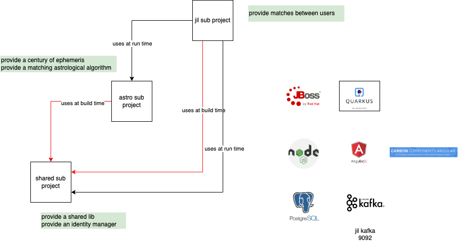
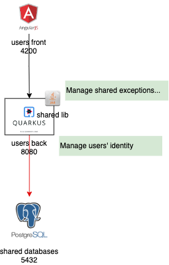
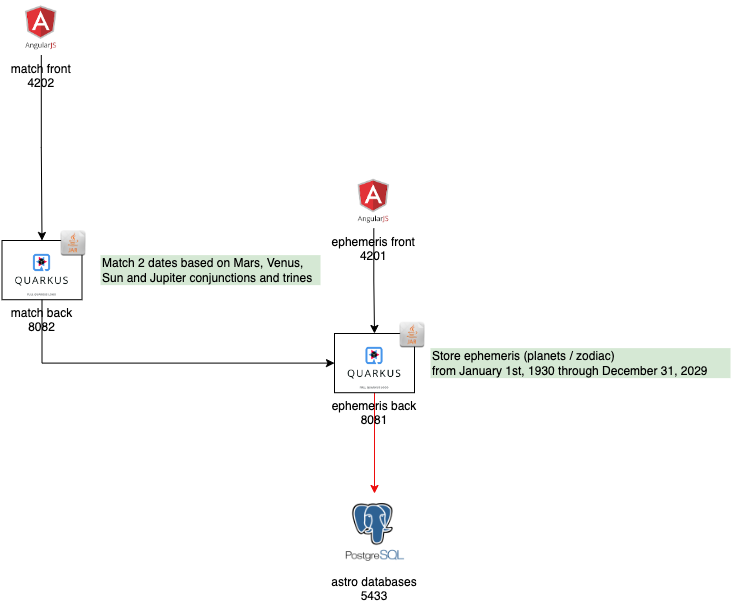
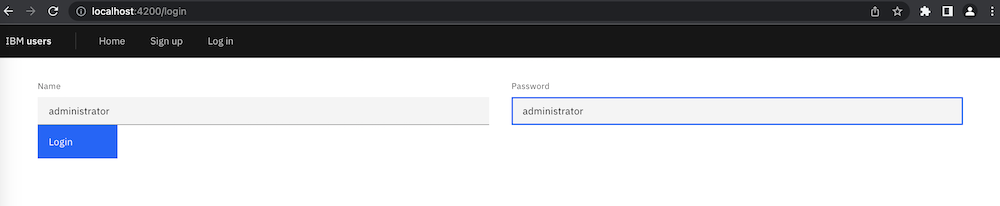
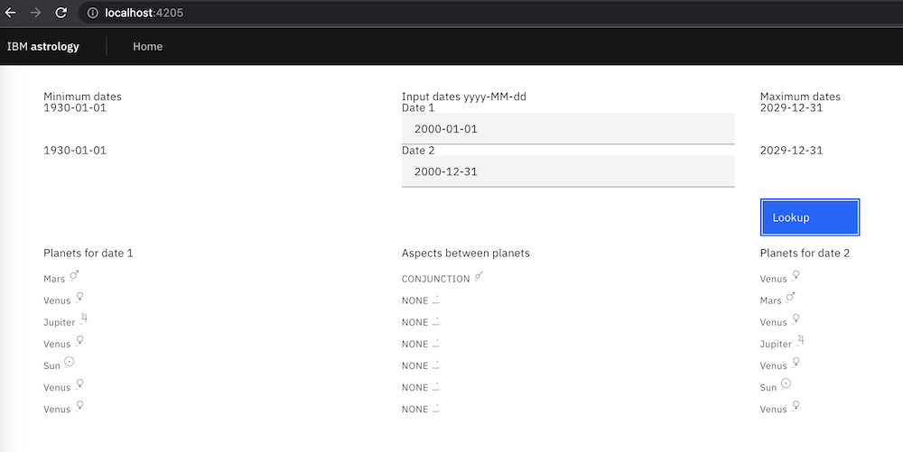
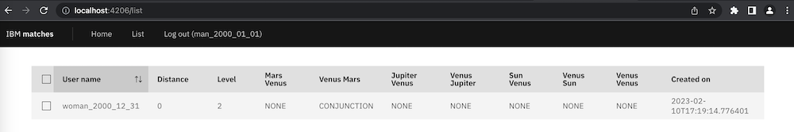

# Source

Backends are developed in Quarkus and run in Jboss.  
Frontents are developed in Carbon Design Angular and run in NodeJS.  
Events run in Kafka.  
Databases run in PostgreSQL.  

Each repository maps to 1 artifact of type:
- library
- database server with 1 or several databases
- event server with several topics
- frontend web server
- backend application server

[Shared utils lib] (https://github.com/pommobile/com_ibm_shared_utils_lib)  
[Shared databases] (https://github.com/pommobile/com_ibm_shared_databases)  
[Shared user back] (https://github.com/pommobile/com_ibm_shared_users_back)  
[Shared user front] (https://github.com/pommobile/com_ibm_shared_users_front)  
[Astro databases] (https://github.com/pommobile/com_ibm_astro_databases)  
[Astro ephemeris back] (https://github.com/pommobile/com_ibm_astro_ephemeris_back)  
[Astro ephemeris front] (https://github.com/pommobile/com_ibm_astro_ephemeris_front)  
[Astro match back] (https://github.com/pommobile/com_ibm_astro_match_back)  
[Astro match front] (https://github.com/pommobile/com_ibm_astro_match_front)  
[Jil databases] (https://github.com/pommobile/com_ibm_jil_databases)  
[Jil defintions back] (https://github.com/pommobile/com_ibm_jil_definitions_back)  
[Jil defintions front] (https://github.com/pommobile/com_ibm_jil_definitions_front)  
[Jil kafka] (https://github.com/pommobile/com_ibm_jil_kafka)  
[Jil profiles back] (https://github.com/pommobile/com_ibm_jil_profiles_back)  
[Jil profiles front] (https://github.com/pommobile/com_ibm_jil_profiles_front)  
[Jil criteria back] (https://github.com/pommobile/com_ibm_jil_criteria_back)  
[Jil criteria front] (https://github.com/pommobile/com_ibm_jil_criteria_front)  
[Jil geolocations back] (https://github.com/pommobile/com_ibm_jil_geolocations_back)  
[Jil geolocations front] (https://github.com/pommobile/com_ibm_jil_geolocations_front)  
[Jil matches back] (https://github.com/pommobile/com_ibm_jil_matches_back)  
[Jil matches front] (https://github.com/pommobile/com_ibm_jil_matches_front)  
[Jil matches maker] (https://github.com/pommobile/com_ibm_jil_matches_maker)  

`git clone https://github.com/pommobile/com_ibm_shared_utils_lib`  
`git clone https://github.com/pommobile/com_ibm_shared_databases`  
`git clone https://github.com/pommobile/com_ibm_shared_users_back`  
`git clone https://github.com/pommobile/com_ibm_shared_users_front`  
`git clone https://github.com/pommobile/com_ibm_astro_databases`  
`git clone https://github.com/pommobile/com_ibm_astro_ephemeris_back`  
`git clone https://github.com/pommobile/com_ibm_astro_ephemeris_front`  
`git clone https://github.com/pommobile/com_ibm_astro_match_back`  
`git clone https://github.com/pommobile/com_ibm_astro_match_front`  
`git clone https://github.com/pommobile/com_ibm_jil_databases`  
`git clone https://github.com/pommobile/com_ibm_jil_definitions_back`  
`git clone https://github.com/pommobile/com_ibm_jil_definitions_front`  
`git clone https://github.com/pommobile/com_ibm_jil_kafka`  
`git clone https://github.com/pommobile/com_ibm_jil_profiles_back`  
`git clone https://github.com/pommobile/com_ibm_jil_profiles_front`  
`git clone https://github.com/pommobile/com_ibm_jil_criteria_back`  
`git clone https://github.com/pommobile/com_ibm_jil_criteria_front`  
`git clone https://github.com/pommobile/com_ibm_jil_geolocations_back`  
`git clone https://github.com/pommobile/com_ibm_jil_geolocations_front`  
`git clone https://github.com/pommobile/com_ibm_jil_matches_back`  
`git clone https://github.com/pommobile/com_ibm_jil_matches_front`  
`git clone https://github.com/pommobile/com_ibm_jil_matches_maker`  

# Architecture

The project is comprised of 3 sub projects:
- shared, used by the 2 others, at build and run times. It provides a shared library and a basic identity manager
- astro (i.e. astrology), used by jil, at run time. It provides planet positions (i.e. ephemeris) for a century and an astrological matching algorithm between 2 days
- jil (i.e. Just in Love). For users who provide their profile, criteria and geolocation, it provides the users that match the astrological algorithm and criteria

## Architecture of shared

Shared consists of:
- a shared java library embedded in all backends. It manages common exceptions and types
- a user identity backend used (http) by most jil backends. It manages logins
- a user identity frontend. It manage users
- a database. It stores users

## Architecture of astro

Shared consists of:
- an ephemeris backend. It lists ephemeris
- an ephemeris fontend.  It displays the ephemeris of a given day
- a database. It stores a century ~ 100 * 365 ephemeris
- a match backend. It implements the astrological matching algorithm between 2 days
- a match fontend. It displays the astrological matching between 2 given days

## Architecture of jil

Shared consists of:
- a definition backend and frontend. It manages definitions, i.e. attributes (gender, avatar...) users use in profile and criteria
- a definition database. It stores definitions (administrator's function)
- a profile backend and frontend. It manages profiles (birthdate, gender, avatar...)
- a profile database. It stores users' profile
- a criteria backend and frontend. It manages criteria (age bracket, gender, avatar, max distance...)
- a criteria database. It stores users' criteria
- a geolocation backend and frontend. It manages geolocations (latitude, longitude)
- a geolocation database. It stores users' geolocation
- a match backend and frontend. It manages users' matches (aspects, distance...)
- a match database. It stores users' matches
- a kafka server. It echoes users' creation, update and deletion on profile, criteria and geolocation. It notifies the match maker of any
- a match maker backend. On notification, it computes the matches (astrology and criteria) of a user. It uses (http) the matches backend as output and all the other backends as inputs

# Run

2 options:
- docker, the easier, as images are pulled from pommobile docker hub
- localhost, the harder, as components have to be locally built and run

## Run in docker

### Prerequisites

- Docker
- All the above repositories cloned
- Be in the top directory of your cloned repositories

### Run network & containers

Create the docker shared network.  

`./com_ibm_shared_databases/src/main/docker/create_network.sh`  

Run containers in that specific order.  

`./com_ibm_shared_databases/src/main/docker/run.sh`  
`./com_ibm_shared_users_back/application/src/main/docker/run.sh`  
`./com_ibm_shared_users_front/src/main/docker/run.sh`  

Check the shared sub project runs ok by opening a web browser at localhost:4200.  
Login with administrator/administrator.  
  

`./com_ibm_astro_databases/src/main/docker/run.sh`  
`./com_ibm_astro_ephemeris_back/application/src/main/docker/run.sh`  
`./com_ibm_astro_ephemeris_front/src/main/docker/run.sh`  
`./com_ibm_astro_match_back/application/src/main/docker/run.sh`  
`./com_ibm_astro_match_front/src/main/docker/run.sh`  

Check the astro sub project runs ok by opening a web browser at localhost:4205.  
Match 2000-01-01 as date1 with 2000-12-31 date2.  
  

`./com_ibm_jil_databases/src/main/docker/run.sh`  
`./com_ibm_jil_definitions_back/application/src/main/docker/run.sh`  
`./com_ibm_jil_definitions_front/src/main/docker/run.sh`  
`./com_ibm_jil_kafka/src/main/docker/run.sh`  
`./com_ibm_jil_profiles_back/application/src/main/docker/run.sh`  
`./com_ibm_jil_profiles_front/src/main/docker/run.sh`  
`./com_ibm_jil_criteria_back/application/src/main/docker/run.sh`  
`./com_ibm_jil_criteria_front/src/main/docker/run.sh`  
`./com_ibm_jil_geolocations_back/application/src/main/docker/run.sh`  
`./com_ibm_jil_geolocations_front/src/main/docker/run.sh`  
`./com_ibm_jil_matches_back/application/src/main/docker/run.sh`  
`./com_ibm_jil_matches_front/src/main/docker/run.sh`  
`./com_ibm_jil_matches_maker/application/src/main/docker/run.sh`  

Check the jil sub project runs ok by opening a web browser at localhost:4206.
  

## Run on localhost

### Prerequisites

- All the above repositories cloned  
- Jdk  
- Maven  
- PostgreSQL (server)  
- pgAdmin (client)  
- Kafka  
- Configure as described below  
- Build as described below  

### Configure

With pgAdmin:
- Keep the default server/5432 for the shared databases
- Create a users database in the shared server
- Create a server/5433 for the astro databases
- Create a ephemeris database in the astro server
- Create a server/5434 for the jil databases
- Create a definitions database in the jil server
- Create a profiles database in the jil server
- Create a criteria database in the jil server
- Create a geolocations database in the jil server
- Create a matches database in the jil server

### Build

All components are built using maven, whatever the type.  
Build the shared library first.  

`cd com_ibm_shared_utils_lib; mvn -DskipTests install; cd ..`  

Then compile all the others.

`for dir in $(ls); do; echo $dir; cd $dir; mvn -DskipTests compile; cd ..; done`

### Run

Keep the PostreSQL servers running.  
Run the kafka server first in 2 terminals.  
`cd $KAFKA_DIR`  
`bin/zookeeper-server-start.sh config/zookeeper.properties`  
`cd $KAFKA_DIR`  
`bin/kafka-server-start.sh config/server.properties`  

All backends are run using quarkus in dev mode.  
Start the backends in that specific order in separate terminals.  

`cd com_ibm_shared_users_back; mvn -DskipTests quarkus:dev`  
`cd com_ibm_astro_ephemeris_back; mvn -DskipTests quarkus:dev`  
`cd com_ibm_astro_match_back; mvn -DskipTests quarkus:dev`  
`cd com_ibm_jil_definitions_back; mvn -DskipTests quarkus:dev`  
`cd com_ibm_jil_profiles_front; mvn -DskipTests quarkus:dev`  
`cd com_ibm_jil_criteria_back; mvn -DskipTests quarkus:dev`  
`cd com_ibm_jil_geolocations_back; mvn -DskipTests quarkus:dev`  
`cd com_ibm_jil_matches_back; mvn -DskipTests quarkus:dev`  
`cd com_ibm_jil_matches_maker; mvn -DskipTests quarkus:dev`  

All frontends are run using ng in dev mode.  
Start the frontends in separate terminals.  

`cd com_ibm_shared_users_front; ng serve`  
`cd com_ibm_astro_ephemeris_front; ng serve`  
`cd com_ibm_astro_match_front; ng serve`  
`cd com_ibm_jil_definitions_front; ng serve`  
`cd com_ibm_jil_profiles_front; ng serve`  
`cd com_ibm_jil_criteria_front; ng serve`  
`cd com_ibm_jil_geolocations_front; ng serve`  
`cd com_ibm_jil_matches_front; ng serve`  

# Use

## Warnings

- There is no SSO between frontends
- Tokens expire after 4 hours 
- Look & feel is basic
- Dates have to be typed in YYYY-MM-DD format
- Inputs are not validated on the frontends
- Inputs are poorly validated on the backtends

## Steps

Create a user, profile, criteria, geolocation, as described in each repository readme.  
Find a birthdate that matches that user's birthdate, as described in the astro match readme.  
Create the matching user, profile, criteria, geolocation.  
Check the match is found by opening a web browser at localhost:4206.  